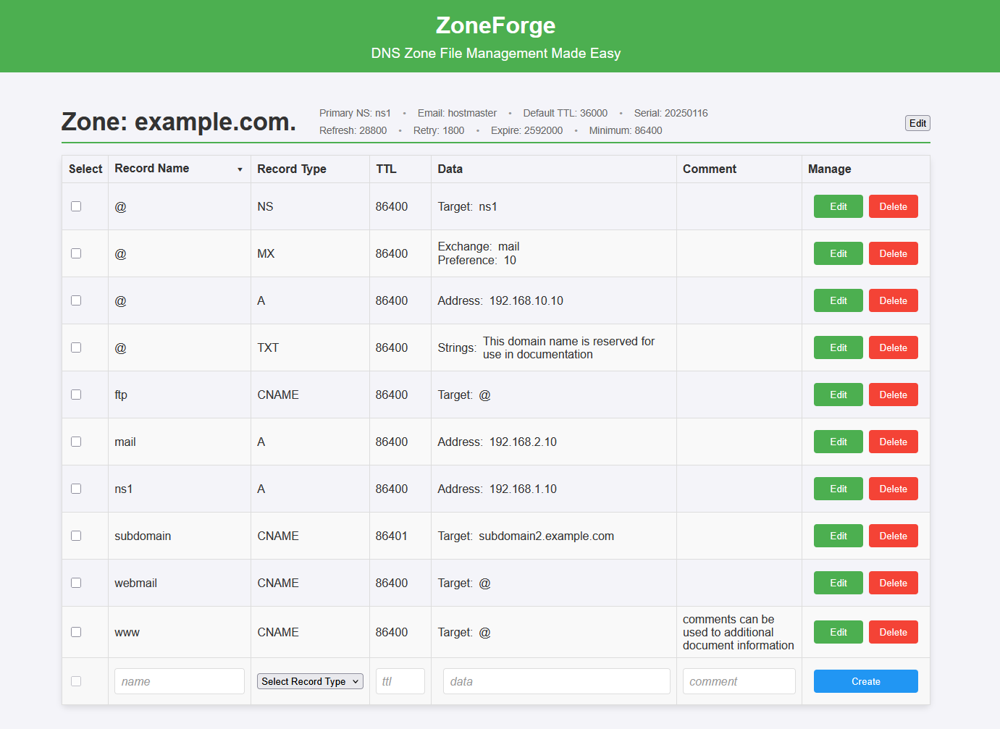

# ZoneForge

ZoneForge is a web UI and REST API to manage [RFC1035](https://rfc-annotations.research.icann.org/rfc1035.html)/BIND style DNS zone files. 




## About

ZoneForge provides a web-based interface and REST API for managing DNS records efficiently. Rather than re-inventing an entire DNS server, ZoneForge serves as a management layer for RFC1035/BIND-style DNS zone files. This project is ideal for administrators who require:
- A centralized, user-friendly tool to manage DNS records.
- Robust REST API.
- Deployment flexibility for various environments.

Zone files are a commonly supported standard for serving [authoritative DNS](https://en.wikipedia.org/wiki/Name_server#Authoritative_name_server) zone records, such as in [BIND](https://www.isc.org/bind/), [NSD](https://github.com/NLnetLabs/nsd), and [CoreDNS's file plugin](https://coredns.io/plugins/file/). While these DNS servers are highly-perfomant and lightweight, they often lack user-friendly management tools, which is where ZoneForge comes in.

## Table of Contents
- [About](#about)
- [Installation](#installation)
- [Configuration](#configuration)
- [API Features](#api-features)
  - [Zones](#zones)
  - [Records](#records)
- [Web UI](#web-ui)
- [Feature Roadmap](#feature-roadmap)
- [Resources](#resources)
  - [Zone Files](#zone-files)
  - [Record Types](#record-types)
  - [RFCs](#rfcs)
  - [Migrating Existing DNS to a Zone File](#migrating-existing-dns-to-a-zone-file)
- [Credits](#credits)

# Installation

Deployment using [the published Docker image](https://github.com/holysoles/zoneforge/pkgs/container/zoneforge) is preferred, as it is tested and includes setup for using Gunicorn as a production WSGI server. Deploy it via Docker/Docker Compose/Kubernetes. Simple usage might look like:

```bash
docker run -d --rm \
  -e ZONE_FILE_FOLDER=/etc/zones \
  -v /path/to/zonefiles:/etc/zones \
  -p 5000:5000 \
  ghcr.io/holysoles/zoneforge:latest
```

Local installation should work as well. Check the Dockerfile for the latest targeted Python version.

```bash
git clone https://github.com/holysoles/zoneforge.git
cd zoneforge
python -m venv .venv
source .venv/bin/activate
pip install -r requirements.txt
gunicorn app:production --bind 0.0.0.0:5000 --workers 4
```

# Configuration

Environment variables are available to configure the application. Additional information about Gunicorn configuration can be found [here](https://docs.gunicorn.org/en/latest/run.html).

| Variable | Default | Description |
| -------- | ------- | ----------- |
| ZONE_FILE_FOLDER | "./lib/examples" | The folder path to store/load zone files. |
| DEFAULT_ZONE_TTL | 86400 | The default TTL for new zones. |
| PORT | 5000 | Port for the web server to listen on. |
| GUNICORN_WORKERS | 4 | How many worker processes to use for Gunicorn. |
| GUNICORN_CMD_ARGS | "--bind 0.0.0.0:\${PORT} --workers \${GUNICORN_WORKERS}" | The command line arguments to pass Gunicorn. |

# API Features

Note that deprecated DNS records are not supported by ZoneForge.

For more comprehensive examples, check out the Swagger/OpenAPI (v2.0) documentation, available at `/api`. [You can also import the spec into Postman](https://learning.postman.com/docs/getting-started/importing-and-exporting/importing-from-swagger/).

## Zones

### Create

```shell
curl -X POST 'http://localhost:5000/api/zones/example.com.' \
--header 'Content-Type: application/json' \
--data '{
    "soa_ttl": "3600",
    "admin_email": "admin@example.com",
    "refresh": "7200",
    "retry": "3600",
    "expire": "1209600",
    "minimum": "3600",
    "primary_ns": "ns1.example.com",
    "primary_ns_ttl": "3600",
    "primary_ns_ip": "192.0.2.1",
    "primary_ns_a_ttl": "3600"
}'
```

### Read

#### Get all zones
```shell
curl -X GET 'http://localhost:5000/api/zones'
```

#### Get specific zone
```shell
curl -X GET 'http://localhost:5000/api/zones/example.com.'
```

### Delete

```shell
curl -X DELETE 'http://localhost:5000/api/zones/example.com.'
```

## Records

- Limited support for record types (A, CNAME, SOA, MX, NS, TXT).
- EOL comments are supported in the `comment` parameter in record related requests.

### Create

```shell
curl -X POST 'http://localhost:5000/api/zones/example.com./records/subdomain' \
--header 'Content-Type: application/json' \
--data '{
    "type": "CNAME",
    "data": "ns100.example.com",
    "comment": "Optional comment"
}'
```

### Read

```shell
curl -X GET 'http://localhost:5000/api/zones/example.com./records/subdomain'
```

### Update

```shell
curl -X PUT 'http://localhost:5000/api/zones/example.com./records/subdomain' \
--header 'Content-Type: application/json' \
--data '{
    "type": "CNAME",
    "data": "subdomain2.example.com"
}'
```

### Delete

```shell
curl -X DELETE 'http://localhost:5000/api/zones/example.com./records/subdomain' \
--header 'Content-Type: application/json' \
--data '{
    "type": "CNAME",
    "data": "subdomain2.example.com"
}'
```

# Web UI

The web UI is written with a focus on being lightweight for ease of maintenance and speed. This is accomplished with Flask templating and server-side rendering whenever possible, with minimal client side javascript with no external dependencies.

# Feature Roadmap

| **Feature**                             | **Status**         |
|-----------------------------------------|--------------------|
| **Web Interface**                       |                    |
|  CRUD for DNS Zones                    | Complete          |
|  CRUD for DNS Records                  | Complete          |
|  Client side validation                | Planned           |
| **REST API**                            |                    |
|  CRUD for DNS Zones                    | Complete          |
|  CRUD for DNS Records                  | Complete          |
|  Thread Safety for DNS Record CRUD     | Backlog           |
|  Zone Name Mutability                  | Backlog           |
|  Patch Method for DNS Zones            | Backlog           |
|  Patch Method for DNS Records          | Backlog           |
| **Management**                          |                    |
|  Authentication                        | In Progress       |
|  Zone Import/Export                    | Backlog           |
|  Preserve Default Zone TTL             | Backlog           |
| **CI/CD**                               |                    |
|  Docker Image                          | Complete          |
|  Test Suite                            | Complete          |
|  Package for PyPi/pip                  | Backlog           |
|  CoreDNS Kubernetes Integration        | Backlog           |


# Resources

## Zone Files

- [Zone File Validator](https://checkzone.dev/) by @woodjme
- [DYN](https://help.dyn.com/how-to-format-a-zone-file/)
- [Oracle](https://docs.oracle.com/en-us/iaas/Content/DNS/Reference/formattingzonefile.htm)

## Record Types

- [Microsoft Overview](https://learn.microsoft.com/en-us/azure/dns/dns-zones-records)

## RFCs

- [RFC1035](https://www.rfc-editor.org/rfc/rfc1035.html)
- [RFC1183](https://www.rfc-editor.org/rfc/rfc1183.html)

## Migrating Existing DNS to a Zone File

For each domain that a given DNS server is authorative for:

1. First ensure that the zone is enabled for Zone transfer. For Windows DNS, this can be found by right-clicking the Zone -> Properties -> Zone Transfers.

2. Install `dig` on a unix-like system

3. Find the name servers if necessary: `dig example.com -t ns`

4. Initiate the Zone Transfer: `dig axfr example.com @dns.example.com | grep -E -v '^;' > db.example.com`

5. The file `db.example.com` should now contain a RFC1035-compatible zone file.

# Contributing

Contributions are welcome. Please follow [conventional commit syntax](https://www.conventionalcommits.org/en/v1.0.0/).

# Credits

Special thanks to the following projects for providing essential libraries:
- [dnspython](https://github.com/rthalley/dnspython)
- [Flask](https://github.com/pallets/flask)
